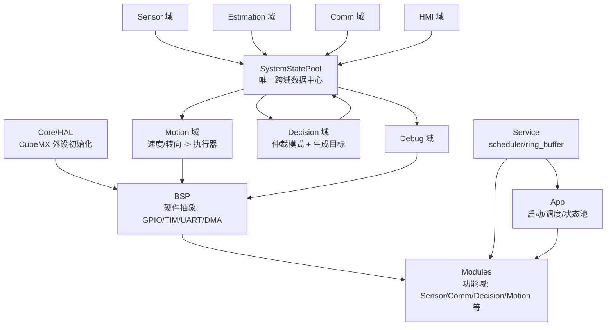

# 嵌入式项目通用软件框架

本文档是当前 STM32G431 阿克曼小车项目的最终框架说明，也可以作为后续裸机/轻量级嵌入式项目的通用模板。

核心目标：

- 代码按职责分层，硬件、业务、算法、通信互不混写。
- 所有跨模块数据通过 `SystemStatePool` 中转，避免模块之间互相调用。
- 所有标定参数集中在 `vehicle_config.h`，实车调参不改业务逻辑。
- 每个模块只暴露 `Init / Task / GetState / SetCommand` 这类稳定接口。
- 主循环使用协作式周期调度，所有任务短小、非阻塞。

## 1. 总体架构

当前工程采用 5 层：

```text
Core/HAL
  ↑
BSP
  ↑
Service
  ↑
Modules
  ↑
App
```

实际依赖方向只能向下：

```text
App -> Modules -> BSP -> Core/HAL
App -> Service
Modules -> Service
```

禁止方向：

```text
Modules -> Modules 直接横向调用
Modules -> App 反向依赖
BSP -> Modules 反向依赖
Comm/Sensor/HMI 直接控制 Motion
Decision 直接写 PWM/舵机
Motion 解析协议或读取按键
```

数据流：



设计原则：

- `Core` 只放 CubeMX/HAL 生成和启动相关代码。
- `BSP` 只封装硬件，不写业务规则。
- `Service` 放跨项目可复用的通用工具。
- `Modules` 放业务域，每个域只负责一类问题。
- `App` 负责初始化、调度、状态池和系统级测试入口。

## 2. 顶层目录职责

### 2.1 `Core/`

用途：CubeMX 生成代码和 MCU 外设初始化。

当前典型文件：

```text
Core/Inc/
  main.h
  gpio.h
  tim.h
  usart.h
  dma.h
  iwdg.h
  stm32g4xx_it.h

Core/Src/
  main.c
  gpio.c
  tim.c
  usart.c
  dma.c
  iwdg.c
  stm32g4xx_it.c
  stm32g4xx_hal_msp.c
```

写什么：

- `MX_GPIO_Init()`、`MX_TIMx_Init()`、`MX_USARTx_UART_Init()`。
- 中断入口、HAL 回调入口。
- 系统时钟、启动代码、HAL MSP 配置。

不写什么：

- 不写业务状态机。
- 不写协议解析。
- 不写 PID、循迹、泊车等算法。
- 不在 `main.c` 里直接控制电机/舵机。

推荐规则：

- CubeMX 可反复生成 `Core`，业务逻辑不要依赖 `Core` 内部细节。
- HAL 回调中只做很薄的转发，例如转发给 `BspUart_DmaRxHalfCplt()`。

### 2.2 `BSP/`

用途：板级支持包，直接操作硬件资源，是业务代码访问硬件的唯一入口。

当前结构：

```text
BSP/Inc/
  bsp_motor.h
  bsp_servo.h
  bsp_encoder.h
  bsp_gpio_sensor.h
  bsp_uart.h
  bsp_key.h
  bsp_led.h
  bsp_buzzer.h

BSP/Src/
  bsp_motor.c
  bsp_servo.c
  bsp_encoder.c
  bsp_gpio_sensor.c
  bsp_uart.c
  bsp_key.c
  bsp_led.c
  bsp_buzzer.c
```

写什么：

- GPIO 读写、TIM PWM、编码器计数、UART DMA、按键消抖、LED、蜂鸣器。
- 硬件引脚、定时器通道、DMA 通道和 HAL 调用。
- 电机占空比、舵机脉宽、串口字节收发这类硬件级接口。

不写什么：

- 不判断当前是手动还是自动。
- 不解析 `AUTO,2`、`S:5`、`TEST,4`。
- 不计算阿克曼、速度环、循迹误差。
- 不依赖 `SystemStatePool`，BSP 应尽量保持可移植。

BSP 头文件规则：

- 头文件不暴露 HAL 类型，如 `UART_HandleTypeDef`、`TIM_HandleTypeDef`。
- 头文件只暴露稳定硬件抽象接口。
- 换芯片、换引脚时优先改 `.c`，尽量不改 `.h`。

当前 BSP 接口：

```c
void BspMotor_Init(void);
void BspMotor_SetDuty(BspMotorId motor, int16_t duty_permille);
void BspMotor_StopAll(void);

bool BspServo_Init(void);
bool BspServo_IsAvailable(void);
void BspServo_SetSteerPermille(int16_t steer_permille);

void BspEncoder_Init(void);
BspEncoderSample BspEncoder_Read(void);

void BspGpioSensor_Init(void);
BspTrackRaw BspGpioSensor_ReadTrack(void);
void BspGpioSensor_TrigSet(bool high);
bool BspGpioSensor_EchoRead(void);

void BspUart_Init(BspUartId id);
bool BspUart_ReadByte(BspUartId id, uint8_t *byte);
uint16_t BspUart_Available(BspUartId id);
bool BspUart_WriteBuffer(BspUartId id, const uint8_t *data, uint16_t len);
bool BspUart_TxDone(BspUartId id);
void BspUart_WriteString(BspUartId id, const char *str);

void BspKey_Init(void);
void BspKey_Task10ms(void);
bool BspKey_TakeClickedEvent(BspKeyId key);

void BspLed_Init(void);
void BspLed_Set(BspLedId led, bool on);
void BspLed_Toggle(BspLedId led);

void BspBuzzer_Init(void);
void BspBuzzer_Beep(uint16_t on_ms);
void BspBuzzer_Play(BuzzerPattern pattern);
void BspBuzzer_Task10ms(void);
```

### 2.3 `Service/`

用途：跨项目复用的通用服务，不绑定具体小车业务。

当前结构：

```text
Service/Inc/
  scheduler.h
  ring_buffer.h

Service/Src/
  scheduler.c
  ring_buffer.c
```

写什么：

- 协作式调度器。
- 环形缓冲区。
- 将来可放通用滤波器、软件定时器、CRC、命令队列、事件队列等。

不写什么：

- 不写小车模式。
- 不写硬件引脚。
- 不写具体协议含义。

当前接口：

```c
void Scheduler_Init(void);
bool Scheduler_AddTask(const char *name,
                       SchedulerTaskFn function,
                       void *context,
                       uint32_t period_ms,
                       uint32_t start_delay_ms);
void Scheduler_Run(uint32_t now_ms);

void RingBuffer_Init(RingBuffer *rb, uint8_t *storage, uint16_t capacity);
bool RingBuffer_PushFromIsr(RingBuffer *rb, uint8_t byte);
bool RingBuffer_Pop(RingBuffer *rb, uint8_t *byte);
uint16_t RingBuffer_Available(const RingBuffer *rb);
void RingBuffer_Flush(RingBuffer *rb);
```

调度器规则：

- 所有任务必须快速返回。
- 任务内禁止 `HAL_Delay()`。
- 周期任务只做本周期该做的工作，不阻塞等待外设。
- 长动作必须写成状态机，用 `tick_ms` 判断时间。

### 2.4 `App/`

用途：应用层入口、任务注册、全局状态池、全局参数、系统测试。

当前结构：

```text
App/Inc/
  app_main.h
  app_tasks.h
  app_test.h
  system_state_pool.h
  vehicle_config.h

App/Src/
  app_main.c
  app_tasks.c
  app_test.c
  system_state_pool.c
```

写什么：

- `App_Init()`：按依赖顺序初始化 BSP、状态池、模块域、调度器。
- `App_Run()`：更新 `g_state.tick_ms`，运行调度器。
- `AppTasks_Register()`：注册所有周期任务。
- `SystemStatePool`：跨域数据结构和一次性事件清理。
- `vehicle_config.h`：所有实车标定参数。
- `app_test.c`：编译期和运行期测试入口。

不写什么：

- 不在 App 中塞具体算法实现。
- 不在 App 中解析复杂协议。
- 不在 App 中直接写 PWM，除非是单独的硬件测试用例。

初始化顺序：

```text
1. BSP 硬件层
2. SystemStatePool
3. Modules 各功能域
4. Scheduler
5. AppTasks_Register()
```

主循环：

```c
void App_Run(void)
{
    g_state.tick_ms = HAL_GetTick();
    Scheduler_Run(g_state.tick_ms);
}
```

测试入口：

```text
TEST_SELECT = TEST_NONE      正常运行
TEST_SELECT = TEST_LED       LED 测试
TEST_SELECT = TEST_KEY       按键测试
TEST_SELECT = TEST_BUZZER    蜂鸣器测试
TEST_SELECT = TEST_MOTOR     电机测试
TEST_SELECT = TEST_SERVO     舵机测试
TEST_SELECT = TEST_ENCODER   编码器测试
TEST_SELECT = TEST_SENSOR    传感器测试
TEST_SELECT = TEST_UART      UART 测试
TEST_SELECT = TEST_SPEED_PID 速度环标定
TEST_SELECT = TEST_PARK_REVERSE  倒车入库测试
TEST_SELECT = TEST_PARK_PARALLEL 侧方停车测试
```

运行时测试：

```text
蓝牙发送 TEST,n 进入测试 n
蓝牙发送 TEST,0 退出测试
```

### 2.5 `Modules/`

用途：业务域。每个域解决一个独立问题，并通过 `SystemStatePool` 与其他域交换数据。

当前结构：

```text
Modules/
  Sensor/
    Inc/sensor_domain.h
    Inc/sensor_internal.h
    Src/sensor_domain.c
    Src/tracker_sensor.c
    Src/ultrasonic_sensor.c

  Estimation/
    Inc/estimation.h
    Src/estimation.c

  Comm/
    Inc/comm.h
    Inc/comm_internal.h
    Src/comm.c
    Src/bt_link.c
    Src/k230_link.c
    Src/protocol.c

  Decision/
    Inc/decision.h
    Src/decision.c

  Motion/
    Inc/motion.h
    Inc/motion_internal.h
    Src/motion.c
    Src/ackermann.c
    Src/speed_pi.c

  HMI/
    Inc/hmi.h
    Inc/hmi_internal.h
    Src/hmi.c
    Src/key_service.c
    Src/led_service.c
    Src/buzzer_service.c

  Debug/
    Inc/debug_trace.h
    Src/debug_trace.c
```

模块域通用接口模板：

```c
void Xxx_Init(void);
void Xxx_Task10ms(SystemStatePool *pool);
void Xxx_Task20ms(SystemStatePool *pool);
XxxState Xxx_GetState(void);
void Xxx_SetCommand(const XxxCommand *cmd);
```

不是每个模块都必须全部实现，但命名风格要统一。

模块内部规则：

- 状态机变量、滤波队列、PI 积分、解析缓存都放 `.c` 的 `static` 变量。
- 对外头文件只暴露必要类型和函数。
- 如果一个域拆多个 `.c`，内部接口放 `xxx_internal.h`。
- 子模块不能被其他域直接 include。

## 3. SystemStatePool 数据中心

文件：

```text
App/Inc/system_state_pool.h
App/Src/system_state_pool.c
```

定位：唯一跨域数据交换中心。

写入规则：

| 域 | 允许写入 | 说明 |
|---|---|---|
| Sensor | `pool->sensor`、`pool->fault.sensor_invalid` | 循迹、超声波、传感器有效性 |
| Estimation | `pool->estimation` | 编码器速度估计 |
| Comm | `pool->comm`、`pool->event.bt_command_ready`、`pool->event.k230_result_ready` | 蓝牙/K230 接收结果 |
| HMI | `pool->event.key_*` | 按键事件 |
| Decision | `pool->mode`、`pool->auto_task`、`pool->target` | 系统模式和运动目标 |
| Motion | `pool->motion`、`pool->fault.servo_limit` | 执行状态和执行限幅 |
| Debug | `pool->debug` | 调试输出开关 |

重要结构：

```c
SystemMode       mode;
SystemAutoTask   auto_task;
SystemTarget     target;
SystemEstimation estimation;
SystemMotion     motion;
SystemSensor     sensor;
SystemEvent      event;
SystemFault      fault;
CommData         comm;
DebugControl     debug;
uint32_t         tick_ms;
```

事件和故障区别：

- `event` 是一次性事件，Decision 消费后调用 `SystemStatePool_ClearCycleEvents()` 清掉。
- `fault` 是持久标志，由各域置位，Decision 根据优先级处理。
- `target` 只能由 Decision 写，Motion 只能读。

新增字段原则：

- 如果是某个模块的原始采样结果，放该模块对应子结构。
- 如果是跨域命令，优先放 `event` 或 `comm`。
- 如果是状态机内部变量，不放 pool，留在模块 `.c` 内部。
- 如果只有 Debug 需要看，优先通过该域 `GetState()` 或 Debug 通道输出，不滥加 pool 字段。

## 4. 当前任务调度

任务注册位置：

```text
App/Src/app_tasks.c
```

当前任务表：

| 任务名 | 周期 | 启动偏移 | 职责 |
|---|---:|---:|---|
| `estimation` | 10ms | 0ms | 编码器采样，计算左右轮和车身速度 |
| `motion` | 10ms | 1ms | 读取目标，执行阿克曼分配和速度环 |
| `hmi_key` | 10ms | 0ms | 按键消抖，生成按键事件 |
| `sensor` | 20ms | 2ms | 循迹/超声波采样 |
| `comm` | 20ms | 4ms | 蓝牙/K230 接收解析 |
| `decision` | 20ms | 6ms | 模式仲裁，生成 `pool->target` |
| `debug_curve` | 100ms | 7ms | 蓝牙输出调试曲线帧 |
| `hmi` | 500ms | 0ms | LED/蜂鸣器更新，喂看门狗 |

时序原则：

- `Estimation -> Motion`：先采样反馈，再执行闭环。
- `Sensor/Comm/HMI -> Decision`：先收集输入，再统一仲裁。
- `Decision -> Motion` 有一个周期延迟是可接受的，换来结构清晰。
- Debug 默认关闭，避免占用蓝牙发送带宽。

新增任务建议：

- 高频闭环：10ms 或更快，但必须非常短。
- 普通逻辑：20ms。
- 通信解析：10ms/20ms，必须非阻塞。
- UI/状态显示：100ms/500ms。
- 长动作：不要 Delay，写状态机。

## 5. 各业务域职责

### 5.1 Sensor 域

文件：

```text
Modules/Sensor/Inc/sensor_domain.h
Modules/Sensor/Src/sensor_domain.c
Modules/Sensor/Src/tracker_sensor.c
Modules/Sensor/Src/ultrasonic_sensor.c
```

职责：

- 读取五路循迹原始 GPIO。
- 根据 `VEHICLE_TRACK_BLACK_LEVEL_HIGH` 转换为“是否检测到黑线”的统一位图。
- 计算循迹误差 `track_error`。
- 更新超声波距离和障碍物标志。
- 写入 `pool->sensor`。

不负责：

- 不决定转向角。
- 不决定停车。
- 不直接控制电机。

接口：

```c
void Sensor_Init(void);
void Sensor_Task20ms(SystemStatePool *pool);
SensorState Sensor_GetState(void);
```

### 5.2 Estimation 域

文件：

```text
Modules/Estimation/Inc/estimation.h
Modules/Estimation/Src/estimation.c
```

职责：

- 读取编码器 delta。
- 根据轮径、编码器线数、减速比、方向符号换算 m/s。
- 写入 `pool->estimation`。

关键参数：

```text
VEHICLE_WHEEL_DIAMETER_M
VEHICLE_ENCODER_PPR
VEHICLE_GEAR_RATIO
VEHICLE_LEFT_ENCODER_SIGN
VEHICLE_RIGHT_ENCODER_SIGN
VEHICLE_LEFT_ENCODER_SPEED_SCALE
VEHICLE_RIGHT_ENCODER_SPEED_SCALE
```

### 5.3 Comm 域

文件：

```text
Modules/Comm/Inc/comm.h
Modules/Comm/Src/comm.c
Modules/Comm/Src/bt_link.c
Modules/Comm/Src/k230_link.c
Modules/Comm/Src/protocol.c
```

职责：

- 从 `BspUart` 非阻塞读取字节。
- 按行解析蓝牙和 K230 协议。
- 将解析结果写入 `pool->comm`。
- 置位 `pool->event.bt_command_ready` 或 `pool->event.k230_result_ready`。

不负责：

- 不停车。
- 不转向。
- 不直接调用 Motion。

蓝牙当前协议：

```text
speed,angle      手动遥控，例如 45,0
STOP             停车
AUTO,1           纯循线
AUTO,2           循线 + K230 任务
DEBUG,0/1        关闭/打开调试曲线
TEST,n           运行测试 n
```

K230 当前协议：

```text
S:n              停车 n 秒
V:n              设置视觉速度等级，V:50=正常，V:10=限速
P:1              倒车入库
P:2              侧方停车
R:angle          右转 angle 度
L:angle          左转 angle 度
```

K230 任务设计：

- 摄像头识别到目标后只作为“预告任务”。
- 车扫到横杆 `2/3/4` 探头同时压线时，才进入精确执行点。
- 如果扫到横杆但没有 K230 预告，继续循线。
- 每次扫到任务横杆后先停车稳定 `VEHICLE_K230_MARK_STABLE_MS`。

### 5.4 Decision 域

文件：

```text
Modules/Decision/Inc/decision.h
Modules/Decision/Src/decision.c
```

职责：

- 读取 `event / fault / sensor / comm / estimation`。
- 进行模式仲裁。
- 执行自动任务状态机。
- 生成目标速度和前轮转角。
- 唯一写入 `pool->target` 的模块。

不负责：

- 不写 PWM。
- 不操作舵机。
- 不读 UART 字节。
- 不读 GPIO。

当前模式：

```text
SYS_MODE_STOP
SYS_MODE_MANUAL
SYS_MODE_LINE_FOLLOW
SYS_MODE_INSPECTION
SYS_MODE_AVOIDANCE
SYS_MODE_ERROR
```

当前自动任务：

```text
AUTO_TASK_NONE
AUTO_TASK_LINE_FOLLOW
AUTO_TASK_LINE_FOLLOW_K230
AUTO_TASK_INSPECTION
```

泊车动作接口：

```c
void DecisionPark_Start(DecisionParkAction action, uint32_t now_ms);
void DecisionPark_Stop(void);
bool DecisionPark_IsActive(void);
bool DecisionPark_IsDone(void);
bool DecisionPark_ComputeTarget(uint32_t now_ms, float *speed, float *steer);
```

新增运动模式时，优先在 Decision 内新增状态机，不要在 Comm 或 HMI 里直接控制底盘。

### 5.5 Motion 域

文件：

```text
Modules/Motion/Inc/motion.h
Modules/Motion/Src/motion.c
Modules/Motion/Src/ackermann.c
Modules/Motion/Src/speed_pi.c
```

职责：

- 读取 `pool->target`。
- 执行速度和转角限幅。
- 按阿克曼模型计算左右轮目标速度。
- 用速度 PI 输出左右电机 PWM。
- 将前轮目标角映射为舵机千分比/脉宽。
- 唯一直接写电机和舵机的逻辑域。
- 写入 `pool->motion` 供 Debug 和上层观察。

不负责：

- 不知道蓝牙协议。
- 不知道 K230 标签。
- 不知道按键含义。
- 不做任务状态机。

关键参数：

```text
VEHICLE_MAX_SPEED_MPS
VEHICLE_WHEELBASE_M
VEHICLE_TRACK_WIDTH_M
VEHICLE_ACKERMANN_RATIO_LIMIT
VEHICLE_ACKERMANN_INNER_MIN_SPEED_MPS
VEHICLE_STEER_CENTER_DEG
VEHICLE_STEER_LEFT_MAX_DEG
VEHICLE_STEER_RIGHT_MAX_DEG
VEHICLE_SPEED_PI_KP
VEHICLE_SPEED_PI_KI
VEHICLE_SPEED_PI_FF_MIN_PWM
VEHICLE_SPEED_PI_FF_GAIN_PWM_PER_MPS
```

### 5.6 HMI 域

文件：

```text
Modules/HMI/Inc/hmi.h
Modules/HMI/Src/hmi.c
Modules/HMI/Src/key_service.c
Modules/HMI/Src/led_service.c
Modules/HMI/Src/buzzer_service.c
```

职责：

- 按键消抖后写入 `pool->event.key_*`。
- 根据 `pool->mode / auto_task / fault` 更新 LED。
- 根据故障或状态更新蜂鸣器。

LED 当前语义：

```text
LED1 常亮    手动模式
LED2 常亮    自动循线
LED3 常亮    循线 + K230
STATE 闪烁   停车/待机
LED1~3 闪烁  ERROR
```

不负责：

- 不直接停车。
- 不直接切换电机。
- 不解析蓝牙命令。

### 5.7 Debug 域

文件：

```text
Modules/Debug/Inc/debug_trace.h
Modules/Debug/Src/debug_trace.c
```

职责：

- 按 100ms 输出 10 通道 float 小端曲线帧。
- 默认关闭，通过 `DEBUG,1` 打开，`DEBUG,0` 关闭。
- 只读 `pool`，不改变系统行为。

当前通道：

| 通道 | 含义 |
|---|---|
| CH1 | `mode` |
| CH2 | `target.speed_mps` |
| CH3 | 左编码器 10ms 原始增量 |
| CH4 | 左轮目标速度 |
| CH5 | 左轮实际速度 |
| CH6 | 左轮 PWM 归一化 |
| CH7 | 右轮目标速度 |
| CH8 | 右轮实际速度 |
| CH9 | 右轮 PWM 归一化 |
| CH10 | 右编码器 10ms 原始增量 |

## 6. 参数集中管理

文件：

```text
App/Inc/vehicle_config.h
```

用途：所有实车标定常数集中在这里。

写什么：

- 车辆几何。
- 最大速度和转角。
- 舵机中位、左极限、右极限。
- 编码器换算参数。
- 速度环 PI 和前馈。
- 循迹传感器电平极性、权重、速度、找线策略。
- K230 任务横杆、稳定时间、任务冷却、泊车动作时间。

不写什么：

- 不写变量。
- 不写状态机。
- 不写硬件初始化。
- 不写协议解析。

参数分类建议：

```text
1. 运动限幅
2. 车辆几何 / 阿克曼模型
3. 巡线控制参数
4. 舵机标定
5. 编码器 / 轮速估计
6. 速度环 PI 参数
7. 调试步进和测试参数
```

换车、换电机、换舵机、换循迹模块时，优先只改这里。

## 7. 新功能放哪里

### 7.1 新增一个传感器

写法：

```text
BSP:
  新建或扩展 bsp_xxx.h/c，只提供原始硬件读数。

Modules/Sensor:
  新建 xxx_sensor.c，将原始值转换成物理量或有效状态。

SystemStatePool:
  如果其他域需要读取该传感器结果，再添加字段。

Decision:
  根据传感器结果决定目标或模式。
```

不要做：

```text
传感器模块直接 Motion_Stop()
传感器 BSP 里直接切模式
```

### 7.2 新增一个通信命令

写法：

```text
Modules/Comm/Src/bt_link.c 或 k230_link.c:
  只解析命令，写入 BtCommand/K230Result。

App/Inc/system_state_pool.h:
  增加命令枚举或参数字段。

Modules/Decision/Src/decision.c:
  消费命令，决定如何改变 mode/target/task。
```

不要做：

```text
Comm 收到命令后直接 BspMotor_SetDuty()
Comm 收到命令后直接调用 Decision 内部静态函数
```

### 7.3 新增一个运动动作

例如掉头、绕障、停车入库：

```text
Modules/Decision:
  写动作状态机，按时间/传感器阶段输出 speed + steer。

App/Inc/vehicle_config.h:
  放动作速度、角度、持续时间等可调参数。

App/Src/app_test.c:
  增加 TEST,n，方便脱离完整任务单独验证动作。
```

Motion 不关心动作名称，只执行速度和转角。

### 7.4 新增一个硬件驱动

```text
BSP/Inc/bsp_xxx.h
BSP/Src/bsp_xxx.c
```

要求：

- 头文件不暴露 HAL 类型。
- 接口尽量稳定，例如 `Init / Read / Write / Set / Get`。
- 实现层可以 include `main.h / tim.h / gpio.h / usart.h`。
- 业务含义不要放进 BSP。

### 7.5 新增一个可视化调试量

优先级：

```text
1. 如果已有 pool 字段，DebugTrace 直接输出。
2. 如果是模块内部状态，先通过 Xxx_GetState() 暴露快照。
3. 如果多个域都需要该值，再考虑放入 SystemStatePool。
```

不要为了临时看一个变量，就把大量内部细节塞进 `SystemStatePool`。

## 8. 通用开发流程

### 8.1 写新模块

1. 建目录：

```text
Modules/NewDomain/Inc/new_domain.h
Modules/NewDomain/Src/new_domain.c
```

2. 定接口：

```c
void NewDomain_Init(void);
void NewDomain_Task20ms(SystemStatePool *pool);
NewDomainState NewDomain_GetState(void);
```

3. 在 `App/Src/app_main.c` 的 `App_Init()` 中初始化。

4. 在 `App/Src/app_tasks.c` 中注册周期任务。

5. 如果需要调参，把参数加到 `App/Inc/vehicle_config.h`。

6. 如果需要测试，把测试项加到 `App/Inc/app_test.h` 和 `App/Src/app_test.c`。

### 8.2 调试顺序

推荐顺序：

```text
1. BSP 单测
2. Sensor/Estimation 单域测试
3. Motion 单域闭环测试
4. Comm 协议测试
5. Decision 状态机测试
6. 整车任务测试
```

原因：

- 先证明硬件驱动可靠，再调业务。
- 编码器、舵机、电机、UART 问题不要和自动任务混在一起排查。
- 每个动作都应该有 `TEST,n` 入口。

### 8.3 提交前检查

每次阶段完成前至少检查：

```text
1. 是否有模块横向 include 其他模块内部头文件。
2. 是否有 Comm/HMI/Sensor 直接控制电机。
3. 是否有任务里 HAL_Delay。
4. 是否把可调参数写死在 .c 文件里。
5. 是否有新状态机没有超时保护。
6. 是否有 UART 发送阻塞。
7. 是否有 Debug 输出默认开启。
8. 是否编译 Debug/Release。
```

## 9. 当前项目硬件映射

| 功能 | MCU 资源 | BSP |
|---|---|---|
| 左电机 PWM | TIM3 CH1/CH2 | `bsp_motor` |
| 右电机 PWM | TIM3 CH3/CH4 | `bsp_motor` |
| 舵机 PWM | TIM1 CH3 / PA10 | `bsp_servo` |
| 左编码器 | TIM2 | `bsp_encoder` |
| 右编码器 | TIM4 | `bsp_encoder` |
| 五路循迹 | GPIO PB3/PB4/PB5/PB8/PB9 | `bsp_gpio_sensor` |
| 超声波 | TRIG/ECHO GPIO | `bsp_gpio_sensor` |
| 蓝牙 | USART3 + DMA | `bsp_uart` |
| K230 | USART2 + DMA | `bsp_uart` |
| LED | GPIO | `bsp_led` |
| 按键 | GPIO | `bsp_key` |
| 蜂鸣器 | GPIO/TIM | `bsp_buzzer` |

## 10. 复用到下一个项目

新项目可以直接复用的部分：

```text
Service/scheduler
Service/ring_buffer
App/system_state_pool 思想
App/app_tasks 调度方式
BSP 头文件风格
Modules 分域方式
DebugTrace 输出方式
app_test 测试入口方式
vehicle_config 参数集中方式
```

新项目需要重写或替换：

```text
Core/        由 CubeMX 按新芯片生成
BSP/Src/     按新硬件引脚和外设实现
vehicle_config.h 按新机械/传感器/控制对象标定
Modules/Decision 根据新业务状态机重写
Modules/Motion   根据新执行器模型重写
```

复用顺序：

```text
1. 先搭 Core + BSP，确保每个硬件 TEST 通过。
2. 搭 App + Scheduler + SystemStatePool。
3. 按输入、估计、决策、执行、调试拆 Modules。
4. 每个新功能先加 TEST，再接入正式任务。
5. 所有实车参数只放 vehicle_config.h。
```

## 11. 最重要的边界

如果后续只记一组规则，记这组：

```text
Comm 只解析，不控制车。
Sensor 只感知，不控制车。
HMI 只产生事件，不控制车。
Decision 只决策，不碰硬件。
Motion 只执行目标，不理解任务。
BSP 只管硬件，不理解业务。
App 只编排，不塞算法。
SystemStatePool 是唯一跨域数据中心。
vehicle_config.h 是唯一实车参数表。
```
