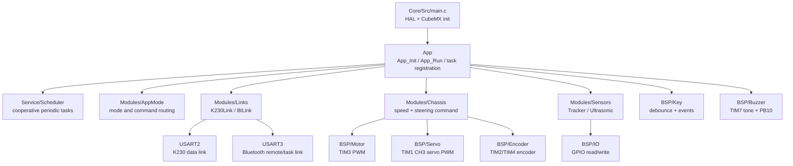
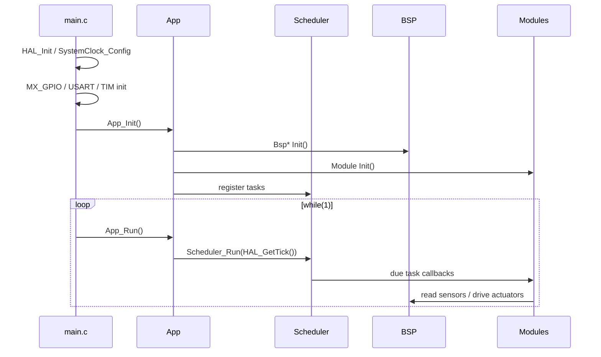
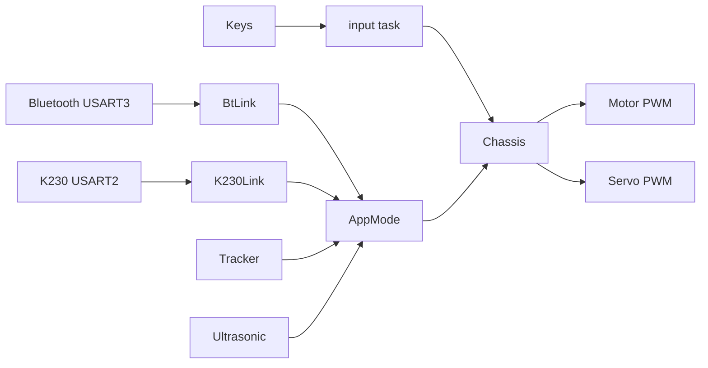

# STM32G431 Ackermann Car Framework

This document describes the current software framework, module boundaries, task schedule, and public interfaces.

## 1. Layer Overview



The rule is:

- `Core/` remains CubeMX/HAL generated code.
- `BSP/` directly touches pins, timers, and HAL handles.
- `Modules/` implements reusable car functions and state machines.
- `App/` wires modules together and registers scheduled tasks.
- `Service/` contains framework utilities such as the scheduler.

## 2. Runtime Flow



Tasks must be short and non-blocking. Do not add long `HAL_Delay()` calls in scheduled tasks.

## 3. Current Hardware Mapping

| Function | MCU Pins | Driver |
|---|---|---|
| Left motor PWM | PA6 / PA7 | `BspMotor`, TIM3 CH1/CH2 |
| Right motor PWM | PB0 / PB1 | `BspMotor`, TIM3 CH3/CH4 |
| Left encoder | PA0 / PA1 | `BspEncoder`, TIM2 encoder |
| Right encoder | PB6 / PB7 | `BspEncoder`, TIM4 encoder |
| Ackermann servo | PA10 | `BspServo`, TIM1 CH3, 50 Hz |
| Passive buzzer | PB10 | `BspBuzzer`, TIM7 interrupt toggles GPIO |
| HCSR04 TRIG | PB2 | `Ultrasonic`, GPIO output |
| HCSR04 ECHO | PB11 | `Ultrasonic`, EXTI rising/falling |
| Keys | PA11 / PA12 / PA15 | `BspKey`, debounced GPIO input |
| Track sensors | PB3 / PB4 / PB5 / PB8 / PB9 | `Tracker`, black line = high level |
| K230 link | USART2 PA2/PA3 | `K230Link` |
| Bluetooth link | USART3 PC10/PC11 | `BtLink` |
| State LED | PC6 | `BspIo` |

## 4. Scheduled Tasks

Defined in `App/Src/app_tasks.c`.

| Task | Period | Purpose |
|---|---:|---|
| `peripheral` | 10 ms | key debounce, buzzer envelope, tracker update, ultrasonic update |
| `chassis` | 10 ms | encoder sample and chassis output update |
| `comm` | 10 ms | K230/Bluetooth parser task and command/result handoff |
| `mode` | 20 ms | mode state machine placeholder |
| `input` | 20 ms | local key event mapping |
| `heartbeat` | 500 ms | state LED toggle |

The scheduler is cooperative. A task runs only when `App_Run()` calls `Scheduler_Run()`.

## 5. Public Interfaces

### App

```c
void App_Init(void);
void App_Run(void);
void AppTasks_Register(void);
```

- `App_Init()` initializes BSP, modules, and task registration.
- `App_Run()` runs the scheduler using `HAL_GetTick()`.

### Scheduler

```c
void Scheduler_Init(void);
bool Scheduler_AddTask(const char *name,
                       SchedulerTaskFn function,
                       void *context,
                       uint32_t period_ms,
                       uint32_t start_delay_ms);
void Scheduler_Run(uint32_t now_ms);
```

Use this for periodic, non-blocking tasks. Maximum task count is currently 16.

### Motor

```c
void BspMotor_Init(void);
void BspMotor_SetDuty(BspMotorId motor, int16_t duty_permille);
void BspMotor_StopAll(void);
```

`duty_permille` range is `-1000..1000`.

- Positive: forward channel PWM.
- Negative: reverse channel PWM.
- Zero: both channels off.

### Encoder

```c
void BspEncoder_Init(void);
BspEncoderSample BspEncoder_Read(void);
```

Returns total count and delta since last read for left/right encoders.

### Servo

```c
bool BspServo_Init(void);
bool BspServo_IsAvailable(void);
void BspServo_SetSteerPermille(int16_t steer_permille);
```

`steer_permille` range is `-1000..1000`.

Current mapping:

- `0` -> `1500 us`
- `-1000` -> `1000 us`
- `1000` -> `2000 us`

The real Ackermann left/right limits should be calibrated later.

### Key

```c
void BspKey_Init(void);
void BspKey_Task10ms(void);
bool BspKey_IsPressed(BspKeyId key);
bool BspKey_TakePressedEvent(BspKeyId key);
bool BspKey_TakeReleasedEvent(BspKeyId key);
bool BspKey_TakeClickedEvent(BspKeyId key);
BspKeyInfo BspKey_GetInfo(BspKeyId key);
```

Keys are debounced in `BspKey_Task10ms()`.

Current key IDs:

- `BSP_KEY_1`
- `BSP_KEY_2`
- `BSP_KEY_3`

### Passive Buzzer

```c
void BspBuzzer_Init(void);
void BspBuzzer_Set(bool on);
void BspBuzzer_SetFrequency(uint16_t frequency_hz);
void BspBuzzer_Beep(uint16_t on_ms);
void BspBuzzer_Play(BuzzerPattern pattern);
void BspBuzzer_Task10ms(void);
void BspBuzzer_IrqHandler(void);
bool BspBuzzer_IsActive(void);
```

The buzzer is passive. `TIM7_IRQHandler()` calls `BspBuzzer_IrqHandler()` to toggle PB10 and generate a tone.

Default tone frequency is `2000 Hz`.

Available patterns:

- `BUZZER_PATTERN_OK`
- `BUZZER_PATTERN_ERROR`
- `BUZZER_PATTERN_START`
- `BUZZER_PATTERN_OBSTACLE`

### Tracker

```c
void Tracker_Init(void);
void Tracker_Task10ms(void);
TrackerState Tracker_GetState(void);
void Tracker_SetActiveHigh(bool active_high);
```

Track sensor rule:

- Black line = high level.
- Default `active_high = true`.

`TrackerState.error` uses weighted positions:

| Sensor | Weight |
|---|---:|
| TRACK_1 | -2000 |
| TRACK_2 | -1000 |
| TRACK_3 | 0 |
| TRACK_4 | 1000 |
| TRACK_5 | 2000 |

### Ultrasonic

```c
void Ultrasonic_Init(void);
void Ultrasonic_Task10ms(void);
void Ultrasonic_Trigger(void);
void Ultrasonic_OnEchoEdge(void);
UltrasonicSample Ultrasonic_GetSample(void);
bool Ultrasonic_IsObstacleNear(uint16_t threshold_mm);
```

The HCSR04 driver is non-blocking at the task level:

- TRIG pulse is generated periodically.
- ECHO rising/falling edges are handled by EXTI.
- Distance is calculated from echo high time.

`PB11` should be configured as rising/falling EXTI. The current code reconfigures this in `MX_GPIO_Init()` user section.

### Chassis

```c
void Chassis_Init(void);
void Chassis_SetCommand(int16_t speed_permille, int16_t steer_permille);
void Chassis_Stop(void);
void Chassis_Task10ms(void);
ChassisState Chassis_GetState(void);
```

Current implementation is open-loop:

- `speed_permille` goes directly to both motors.
- `steer_permille` goes directly to the servo.
- encoder deltas are sampled every 10 ms.

PID speed control and Ackermann steering calibration are not implemented yet.

### K230 Link

```c
void K230Link_Init(void);
void K230Link_OnRxByte(uint8_t byte);
void K230Link_Task(void);
bool K230Link_GetLatestResult(K230Result *result);
void K230Link_SendStatus(void);
```

USART2 is reserved for K230 recognition results. The protocol is currently a placeholder.

Reserved result types:

- `K230_RESULT_LINE`
- `K230_RESULT_TARGET`
- `K230_RESULT_MARKER`
- `K230_RESULT_CUSTOM`

### Bluetooth Link

```c
void BtLink_Init(void);
void BtLink_OnRxByte(uint8_t byte);
void BtLink_Task(void);
bool BtLink_TakeCommand(BtCommand *command);
void BtLink_SendStatus(void);
```

USART3 is reserved for the custom Bluetooth remote controller and task commands. The protocol is currently a placeholder.

Reserved command types:

- `BT_COMMAND_STOP`
- `BT_COMMAND_SET_MODE`
- `BT_COMMAND_MANUAL_MOVE`
- `BT_COMMAND_START_TASK`
- `BT_COMMAND_PAUSE_TASK`
- `BT_COMMAND_SET_PARAM`
- `BT_COMMAND_CUSTOM`

### App Mode

```c
void AppMode_Init(void);
void AppMode_SetMode(AppMode mode);
AppModeState AppMode_GetState(void);
void AppMode_HandleBtCommand(const BtCommand *command);
void AppMode_HandleK230Result(const K230Result *result);
void AppMode_Task20ms(void);
```

Current modes:

- `APP_MODE_STOP`
- `APP_MODE_MANUAL`
- `APP_MODE_LINE_FOLLOW`
- `APP_MODE_INSPECTION`
- `APP_MODE_AVOIDANCE`
- `APP_MODE_ERROR`

Only `BT_COMMAND_STOP` has a concrete behavior for now. The rest are placeholders for later control logic.

## 6. Current Data Paths



## 7. Next Development Steps

Recommended order:

1. Calibrate servo center, left limit, and right limit.
2. Verify motor direction and encoder sign.
3. Add motor speed PID.
4. Define Bluetooth command protocol.
5. Define K230 recognition result protocol.
6. Implement line-following control using `TrackerState.error`.
7. Implement obstacle handling using `UltrasonicSample`.
8. Implement inspection task state machine.

