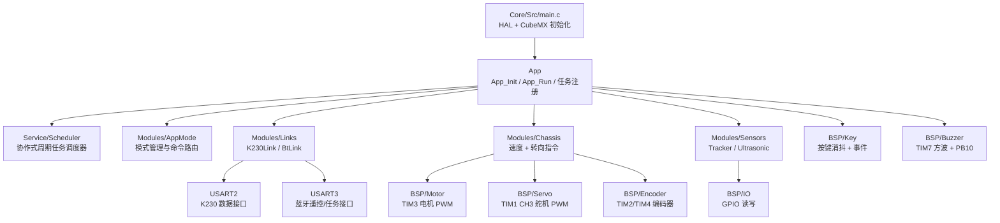
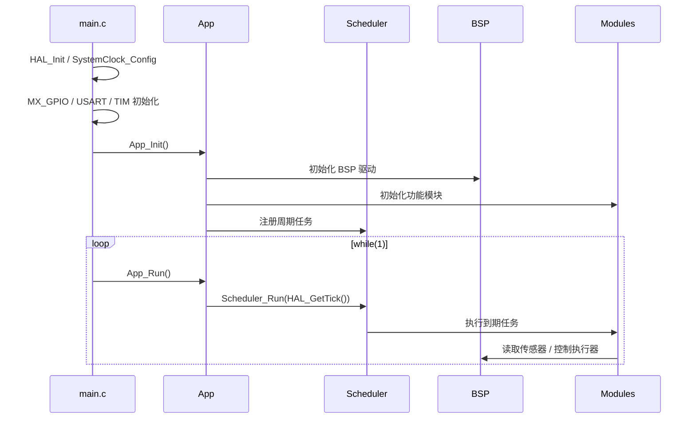
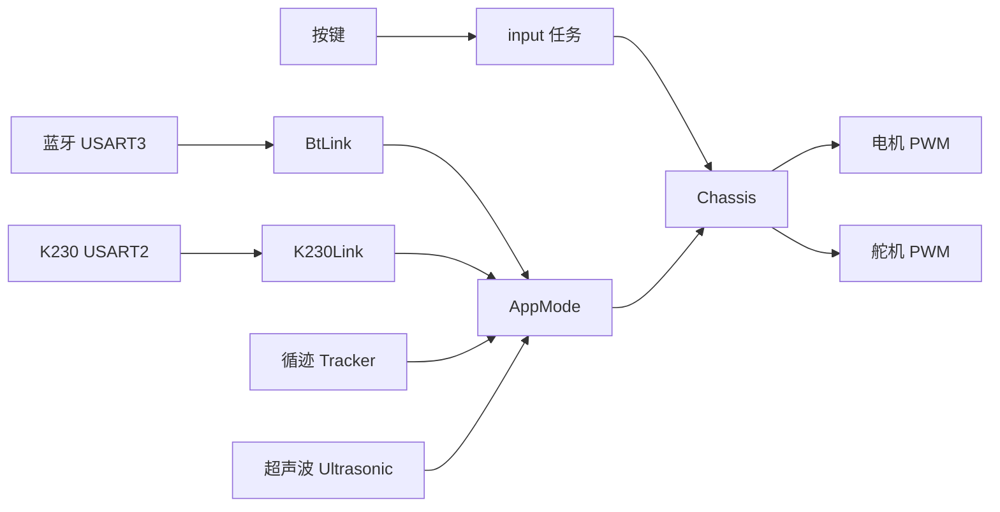

# STM32G431 阿克曼小车软件框架说明

本文档说明当前工程的软件分层、模块职责、任务调度、硬件映射和主要接口。

## 1. 分层框架



分层规则：

- `Core/`：CubeMX/HAL 生成代码，主要负责底层外设初始化。
- `BSP/`：板级支持包，直接操作 GPIO、TIM、UART 等硬件资源。
- `Modules/`：小车功能模块，例如底盘、循迹、超声波、通信链路、模式管理。
- `App/`：应用入口，负责初始化模块、注册任务、组织数据流。
- `Service/`：通用服务，目前包含轻量级周期调度器。

原则：业务逻辑不要直接操作 HAL 外设，应该通过 BSP 或 Modules 的接口访问。

## 2. 运行流程



当前系统不是 RTOS，而是协作式周期调度。任务必须短小、非阻塞。不要在任务里加入长时间 `HAL_Delay()`。

## 3. 当前硬件映射

| 功能 | MCU 引脚 | 驱动/外设 |
|---|---|---|
| 左电机 PWM | PA6 / PA7 | `BspMotor`，TIM3 CH1/CH2 |
| 右电机 PWM | PB0 / PB1 | `BspMotor`，TIM3 CH3/CH4 |
| 左轮编码器 | PA0 / PA1 | `BspEncoder`，TIM2 编码器模式 |
| 右轮编码器 | PB6 / PB7 | `BspEncoder`，TIM4 编码器模式 |
| 阿克曼转向舵机 | PA10 | `BspServo`，TIM1 CH3，50Hz |
| 无源蜂鸣器 | PB10 | `BspBuzzer`，TIM7 中断翻转 GPIO |
| HCSR04 TRIG | PB2 | `Ultrasonic`，GPIO 输出 |
| HCSR04 ECHO | PB11 | `Ultrasonic`，EXTI 上升沿/下降沿 |
| 按键 | PA11 / PA12 / PA15 | `BspKey`，GPIO 输入 + 消抖 |
| 五路循迹 | PB3 / PB4 / PB5 / PB8 / PB9 | `Tracker`，黑线为高电平 |
| K230 通信 | USART2 PA2/PA3 | `K230Link` |
| 蓝牙通信 | USART3 PC10/PC11 | `BtLink` |
| 状态 LED | PC6 | `BspIo` |

## 4. 周期任务

任务注册位置：`App/Src/app_tasks.c`

| 任务名 | 周期 | 作用 |
|---|---:|---|
| `peripheral` | 10ms | 按键消抖、蜂鸣器节拍、循迹更新、超声波更新 |
| `chassis` | 10ms | 编码器采样、底盘输出更新 |
| `comm` | 10ms | K230/蓝牙通信任务，转发命令和识别结果 |
| `mode` | 20ms | 模式状态机预留 |
| `input` | 20ms | 本地按键事件映射 |
| `heartbeat` | 500ms | 状态 LED 翻转 |

调度器由 `App_Run()` 调用：

```c
void App_Run(void)
{
    Scheduler_Run(HAL_GetTick());
}
```

## 5. 主要接口说明

### 5.1 App 应用入口

```c
void App_Init(void);
void App_Run(void);
void AppTasks_Register(void);
```

- `App_Init()`：初始化 BSP、Modules，并注册任务。
- `App_Run()`：在主循环中调用调度器。
- `AppTasks_Register()`：注册所有周期任务。

### 5.2 Scheduler 调度器

```c
void Scheduler_Init(void);
bool Scheduler_AddTask(const char *name,
                       SchedulerTaskFn function,
                       void *context,
                       uint32_t period_ms,
                       uint32_t start_delay_ms);
void Scheduler_Run(uint32_t now_ms);
```

说明：

- 当前最大任务数为 16。
- `period_ms` 是任务周期。
- `start_delay_ms` 用于错开任务启动时间，避免多个任务同一时刻集中运行。
- 任务函数必须快速返回。

### 5.3 电机驱动 BspMotor

```c
void BspMotor_Init(void);
void BspMotor_SetDuty(BspMotorId motor, int16_t duty_permille);
void BspMotor_StopAll(void);
```

`duty_permille` 范围：

```text
-1000 ~ 1000
```

含义：

- 正数：正转 PWM。
- 负数：反转 PWM。
- 0：停止输出。

当前为开环 PWM 输出，尚未做速度闭环。

### 5.4 编码器驱动 BspEncoder

```c
void BspEncoder_Init(void);
BspEncoderSample BspEncoder_Read(void);
```

返回数据：

```c
typedef struct
{
    int32_t left_count;
    int32_t right_count;
    int32_t left_delta;
    int32_t right_delta;
} BspEncoderSample;
```

- `left_count/right_count`：当前累计计数。
- `left_delta/right_delta`：距离上一次读取的增量。

后续速度 PID 会使用 `delta` 计算轮速。

### 5.5 舵机驱动 BspServo

```c
bool BspServo_Init(void);
bool BspServo_IsAvailable(void);
void BspServo_SetSteerPermille(int16_t steer_permille);
```

`steer_permille` 范围：

```text
-1000 ~ 1000
```

当前 PWM 映射：

| 输入 | PWM 脉宽 |
|---:|---:|
| -1000 | 1000us |
| 0 | 1500us |
| 1000 | 2000us |

注意：这只是通用舵机范围。实车需要标定中位、左极限、右极限，避免机械结构顶死。

### 5.6 按键驱动 BspKey

```c
void BspKey_Init(void);
void BspKey_Task10ms(void);
bool BspKey_IsPressed(BspKeyId key);
bool BspKey_TakePressedEvent(BspKeyId key);
bool BspKey_TakeReleasedEvent(BspKeyId key);
bool BspKey_TakeClickedEvent(BspKeyId key);
BspKeyInfo BspKey_GetInfo(BspKeyId key);
```

按键编号：

```c
BSP_KEY_1
BSP_KEY_2
BSP_KEY_3
```

事件接口使用 `Take` 语义：读取后事件会被清除。

当前 `input` 任务里暂时做了一个最小映射：

```c
KEY1 点击 -> Chassis_Stop()
```

后续可以扩展为模式切换、启动任务、暂停任务等。

### 5.7 无源蜂鸣器 BspBuzzer

```c
void BspBuzzer_Init(void);
void BspBuzzer_Set(bool on);
void BspBuzzer_SetFrequency(uint16_t frequency_hz);
void BspBuzzer_Beep(uint16_t on_ms);
void BspBuzzer_Play(BuzzerPattern pattern);
void BspBuzzer_Task10ms(void);
void BspBuzzer_IrqHandler(void);
bool BspBuzzer_IsActive(void);
```

硬件说明：

- 蜂鸣器为无源蜂鸣器。
- PB10 保持 GPIO 输出。
- TIM7 中断周期翻转 PB10，产生方波声音。
- 默认频率为 2000Hz。

预设提示音：

```c
BUZZER_PATTERN_OK
BUZZER_PATTERN_ERROR
BUZZER_PATTERN_START
BUZZER_PATTERN_OBSTACLE
```

中断入口：

```c
void TIM7_IRQHandler(void)
{
    BspBuzzer_IrqHandler();
}
```

### 5.8 循迹模块 Tracker

```c
void Tracker_Init(void);
void Tracker_Task10ms(void);
TrackerState Tracker_GetState(void);
void Tracker_SetActiveHigh(bool active_high);
```

当前硬件规则：

```text
检测到黑线 = 高电平
```

因此默认：

```c
Tracker_SetActiveHigh(true);
```

状态结构：

```c
typedef struct
{
    uint8_t bits;
    uint8_t active_count;
    int16_t error;
    bool line_detected;
    bool crossroad;
} TrackerState;
```

权重定义：

| 传感器 | 权重 |
|---|---:|
| TRACK_1 | -2000 |
| TRACK_2 | -1000 |
| TRACK_3 | 0 |
| TRACK_4 | 1000 |
| TRACK_5 | 2000 |

`error` 后续可作为循迹 PID 的输入。

### 5.9 超声波模块 Ultrasonic

```c
void Ultrasonic_Init(void);
void Ultrasonic_Task10ms(void);
void Ultrasonic_Trigger(void);
void Ultrasonic_OnEchoEdge(void);
UltrasonicSample Ultrasonic_GetSample(void);
bool Ultrasonic_IsObstacleNear(uint16_t threshold_mm);
```

工作方式：

- `TRIG` 输出 10us 高电平。
- `ECHO` 使用 EXTI 双边沿。
- 上升沿记录开始时间。
- 下降沿记录高电平宽度。
- 根据高电平宽度计算距离。

状态结构：

```c
typedef struct
{
    UltrasonicStatus status;
    uint16_t distance_mm;
    uint32_t echo_us;
    uint32_t last_update_ms;
    bool valid;
} UltrasonicSample;
```

注意：

- `PB11` 需要双边沿中断。
- 当前代码在 `MX_GPIO_Init()` 的用户区重配为 `GPIO_MODE_IT_RISING_FALLING`。
- 超声波测距后续需要实车校准和滤波。

### 5.10 底盘模块 Chassis

```c
void Chassis_Init(void);
void Chassis_SetCommand(int16_t speed_permille, int16_t steer_permille);
void Chassis_Stop(void);
void Chassis_Task10ms(void);
ChassisState Chassis_GetState(void);
```

当前状态结构：

```c
typedef struct
{
    int16_t speed_permille;
    int16_t steer_permille;
    int32_t left_encoder_delta;
    int32_t right_encoder_delta;
} ChassisState;
```

当前实现：

- `speed_permille` 直接输出到左右电机。
- `steer_permille` 直接输出到舵机。
- 每 10ms 读取一次编码器增量。

尚未实现：

- 电机速度 PID。
- 阿克曼转向模型。
- 舵机中位/限位标定。
- 速度斜坡和安全限幅。

### 5.11 K230 通信接口 K230Link

```c
void K230Link_Init(void);
void K230Link_OnRxByte(uint8_t byte);
void K230Link_Task(void);
bool K230Link_GetLatestResult(K230Result *result);
void K230Link_SendStatus(void);
```

用途：

```text
USART2 -> K230 识别结果接口
```

预留识别结果类型：

```c
K230_RESULT_LINE
K230_RESULT_TARGET
K230_RESULT_MARKER
K230_RESULT_CUSTOM
```

当前只是接口占位，尚未定义具体协议。

### 5.12 蓝牙通信接口 BtLink

```c
void BtLink_Init(void);
void BtLink_OnRxByte(uint8_t byte);
void BtLink_Task(void);
bool BtLink_TakeCommand(BtCommand *command);
void BtLink_SendStatus(void);
```

用途：

```text
USART3 -> 自写蓝牙遥控器 / 任务指令接口
```

预留命令类型：

```c
BT_COMMAND_STOP
BT_COMMAND_SET_MODE
BT_COMMAND_MANUAL_MOVE
BT_COMMAND_START_TASK
BT_COMMAND_PAUSE_TASK
BT_COMMAND_SET_PARAM
BT_COMMAND_CUSTOM
```

当前只是接口占位，尚未定义具体协议。

### 5.13 模式管理 AppMode

```c
void AppMode_Init(void);
void AppMode_SetMode(AppMode mode);
AppModeState AppMode_GetState(void);
void AppMode_HandleBtCommand(const BtCommand *command);
void AppMode_HandleK230Result(const K230Result *result);
void AppMode_Task20ms(void);
```

当前模式：

```c
APP_MODE_STOP
APP_MODE_MANUAL
APP_MODE_LINE_FOLLOW
APP_MODE_INSPECTION
APP_MODE_AVOIDANCE
APP_MODE_ERROR
```

当前只实现了最基础行为：

```text
BT_COMMAND_STOP -> APP_MODE_STOP -> Chassis_Stop()
```

其他模式逻辑后续补充。

## 6. 当前数据流



## 7. 当前完成状态

已完成第一版：

- 软件分层框架。
- 协作式任务调度器。
- 电机 PWM 驱动。
- 编码器驱动。
- 舵机 PWM 驱动。
- 按键消抖驱动。
- 无源蜂鸣器方波驱动。
- 五路循迹读取与偏差计算。
- 超声波非阻塞测距框架。
- K230 通信接口占位。
- 蓝牙通信接口占位。
- 模式管理接口占位。

尚未完成：

- 电机速度 PID。
- 阿克曼转向几何和舵机限位标定。
- 蓝牙协议解析。
- K230 协议解析。
- 循迹控制算法。
- 自动巡检状态机。
- 避障策略。
- 传感器实车校准和滤波。

## 8. 后续建议开发顺序

1. 标定舵机中位、左极限、右极限。
2. 校验电机方向和编码器方向。
3. 实现左右轮速度 PID。
4. 定义蓝牙遥控协议。
5. 定义 K230 识别结果协议。
6. 基于 `TrackerState.error` 实现循迹控制。
7. 基于 `UltrasonicSample` 实现障碍物安全策略。
8. 实现自动巡检任务状态机。

