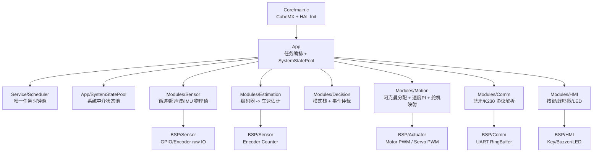
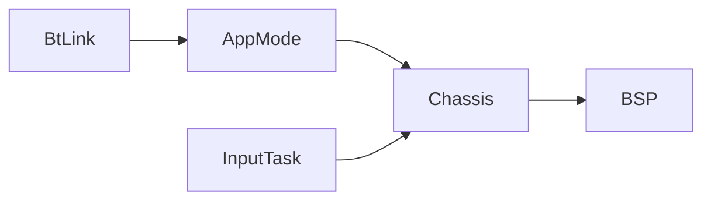
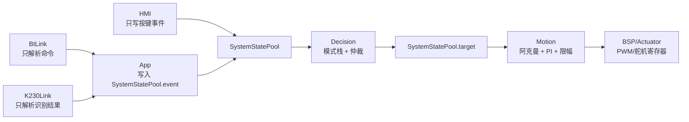

# 软件框架说明与接口定义（V2.0 重构版）

适用项目：STM32G431 阿克曼结构自动巡检小车  
运行模型：裸机，无 RTOS，协作式调度器  
机械结构：阿克曼转向，舵机控制前轮转角  
文档状态：V2.0 架构重构设计文档，作为后续代码重构依据

## 0. 当前代码与 Git 状态快照

当前分支：

```text
master
```

当前工作区：

```text
clean
```

最近提交历史：

```text
4c43645 / 27f498f / 87cee4e  文档中文化与 merge
8e1fc5d  Document framework interfaces
fb513b3  Drive passive buzzer with timer tone
7a551ae  Add peripheral drivers
dd16e91  Add communication link interfaces
5ec233a  Initial commit
```

当前旧版代码中需要在 V2 重构时修正的关键点：

- `Modules/Src/app_mode.c` 直接 `#include "chassis.h"`，并直接调用 `Chassis_Stop()`，这违反 V2 的单向依赖与中介者原则。
- `App/Src/app_tasks.c` 的 `input` 任务在按键点击后直接调用 `Chassis_Stop()`，V2 中应改为写入 `SystemStatePool.event` 或 `SystemStatePool.fault`。
- `BtLink` 当前只是占位解析，尚未与系统状态池建立规范数据交互。
- `Chassis` 当前是开环底盘接口，V2 中应升级为 `Motion Domain`，只读取目标线速度/前轮转角并输出到 BSP 执行器。

本文档下面给出新的目标架构。

## 1. 架构宪法

以下规则优先级最高，后续所有代码生成和重构必须遵守。

### 1.1 单向依赖流

依赖方向只能是：

```text
App -> Modules / Service -> BSP -> Core/HAL
```

禁止：

```text
Modules -> Modules 横向直接调用
Modules -> App 反向依赖
BSP -> Modules 反向依赖
```

错误示例：

```c
// 错误：通信模块直接控制底盘
BtLink_Task20ms()
{
    Chassis_Stop();
}
```

正确方式：

```text
BtLink 解析出 STOP 命令
    -> App 将命令写入 SystemStatePool
    -> Decision 读取命令并计算 target.speed = 0
    -> Motion 读取 target 并执行减速/刹车
```

### 1.2 中介者模式：SystemStatePool

系统状态池位于 App 层，是唯一跨域数据交换中心。

所有模块不得直接调用其他模块的控制函数。模块之间只通过状态池交换结果、目标值、故障标志和事件。

```text
Communication 不控制 Motion
Sensor 不控制 Motion
HMI 不控制 Motion
Decision 不写 PWM
Motion 不解析协议
```

### 1.3 数据隐藏

每个模块的 `.h` 文件只暴露以下类别接口：

```c
Init()
TaskXms()
GetState()
SetCommand()
```

模块内部的内容必须保持 `static`：

- PID 参数
- 滤波队列
- 状态机变量
- 串口解析缓存
- 超声波测距中间时间戳
- 阿克曼几何参数

## 2. V2 目标目录结构

```text
App/
  Inc/
    app_main.h
    app_tasks.h
    system_state_pool.h
  Src/
    app_main.c
    app_tasks.c
    system_state_pool.c

Service/
  Inc/
    scheduler.h
    ring_buffer.h
  Src/
    scheduler.c
    ring_buffer.c

Modules/
  Sensor/
    Inc/sensor_domain.h
    Src/sensor_domain.c
    Src/tracker_sensor.c
    Src/ultrasonic_sensor.c

  Estimation/
    Inc/estimation.h
    Src/estimation.c

  Decision/
    Inc/decision.h
    Src/decision.c

  Motion/
    Inc/motion.h
    Src/motion.c
    Src/ackermann.c
    Src/speed_pi.c

  Comm/
    Inc/comm.h
    Src/comm.c
    Src/bt_link.c
    Src/k230_link.c
    Src/protocol.c

  HMI/
    Inc/hmi.h
    Src/hmi.c
    Src/key_service.c
    Src/buzzer_service.c
    Src/led_service.c

BSP/
  Actuator/
    Inc/bsp_motor.h
    Inc/bsp_servo.h
    Src/bsp_motor.c
    Src/bsp_servo.c

  Sensor/
    Inc/bsp_encoder.h
    Inc/bsp_gpio_sensor.h
    Src/bsp_encoder.c
    Src/bsp_gpio_sensor.c

  HMI/
    Inc/bsp_buzzer.h
    Inc/bsp_key.h
    Inc/bsp_led.h
    Src/bsp_buzzer.c
    Src/bsp_key.c
    Src/bsp_led.c

  Comm/
    Inc/bsp_uart.h
    Src/bsp_uart.c

Core/
  CubeMX generated files
```

旧文件迁移关系：

| 旧文件 | V2 目标位置 |
|---|---|
| `Modules/chassis.*` | `Modules/Motion/motion.*` |
| `Modules/app_mode.*` | `Modules/Decision/decision.*` |
| `Modules/bt_link.*` | `Modules/Comm/bt_link.*` |
| `Modules/k230_link.*` | `Modules/Comm/k230_link.*` |
| `Modules/tracker.*` | `Modules/Sensor/tracker_sensor.*` |
| `Modules/ultrasonic.*` | `Modules/Sensor/ultrasonic_sensor.*` |
| `BSP/bsp_motor.*` | `BSP/Actuator/bsp_motor.*` |
| `BSP/bsp_servo.*` | `BSP/Actuator/bsp_servo.*` |
| `BSP/bsp_key.*` | `BSP/HMI/bsp_key.*` |
| `BSP/bsp_buzzer.*` | `BSP/HMI/bsp_buzzer.*` |

## 3. V2 分层框架图



关键点：

- `SystemStatePool` 不做复杂算法，只存储目标、反馈、事件、故障。
- `Decision` 只决定目标，不操作硬件。
- `Motion` 只执行运动控制，不解析协议、不读按键。
- `Comm` 只解析通信，不控制底盘。
- `HMI` 只处理人机交互，不直接停车。

## 4. SystemStatePool 定义

建议文件：

```text
App/Inc/system_state_pool.h
App/Src/system_state_pool.c
```

### 4.1 状态池结构

```c
typedef enum
{
    SYS_MODE_STOP = 0,
    SYS_MODE_MANUAL,
    SYS_MODE_LINE_FOLLOW,
    SYS_MODE_INSPECTION,
    SYS_MODE_AVOIDANCE,
    SYS_MODE_ERROR
} SystemMode;

typedef struct
{
    float speed_mps;
    float steer_angle_rad;
    bool valid;
} SystemTarget;

typedef struct
{
    float left_speed_mps;
    float right_speed_mps;
    float body_speed_mps;
    int32_t left_encoder_delta;
    int32_t right_encoder_delta;
    bool valid;
} SystemEstimation;

typedef struct
{
    uint8_t track_bits;
    int16_t track_error;
    bool track_valid;
    uint16_t ultrasonic_mm;
    bool ultrasonic_valid;
    bool obstacle_near;
} SystemSensor;

typedef struct
{
    bool bt_command_ready;
    bool k230_result_ready;
    bool key_stop_clicked;
    bool task_start_requested;
    bool task_pause_requested;
} SystemEvent;

typedef struct
{
    bool heartbeat_lost;
    bool obstacle_too_close;
    bool sensor_invalid;
    bool motor_stall;
    bool servo_limit;
    bool emergency_stop;
} SystemFault;

typedef struct
{
    SystemMode mode;
    SystemTarget target;
    SystemEstimation estimation;
    SystemSensor sensor;
    SystemEvent event;
    SystemFault fault;
    uint32_t tick_ms;
} SystemStatePool;
```

### 4.2 状态池访问接口

```c
void SystemStatePool_Init(SystemStatePool *pool);
void SystemStatePool_ClearCycleEvents(SystemStatePool *pool);
```

约束：

- `App` 创建并持有 `SystemStatePool` 实例。
- 周期任务按固定顺序把 `pool` 指针传入各域任务。
- ISR 不直接操作状态池。
- 状态池不是锁，也不是消息队列；它是裸机系统中的单线程共享数据快照。

## 5. 时间触发隔离

调度器是唯一任务时钟源。

### 5.1 任务槽设计

| 槽位 | 周期 | 运行内容 | 说明 |
|---|---:|---|---|
| 硬实时槽 | 10ms | `Estimation_Task10ms`、`Motion_Task10ms` | 编码器速度估计、速度闭环、执行输出 |
| 逻辑槽 | 20ms | `Sensor_Task20ms`、`Comm_Task20ms`、`Decision_Task20ms` | 传感器滤波、协议解析、模式仲裁 |
| 低优先槽 | 500ms | `HMI_Task500ms` | LED 闪烁、蜂鸣器策略、状态心跳回传 |

### 5.2 推荐调度顺序

```c
void AppTasks_Register(void)
{
    Scheduler_AddTask("estimation", Task_Estimation10ms, &g_state, 10U, 0U);
    Scheduler_AddTask("motion",     Task_Motion10ms,     &g_state, 10U, 1U);

    Scheduler_AddTask("sensor",     Task_Sensor20ms,     &g_state, 20U, 2U);
    Scheduler_AddTask("comm",       Task_Comm20ms,       &g_state, 20U, 4U);
    Scheduler_AddTask("decision",   Task_Decision20ms,   &g_state, 20U, 6U);

    Scheduler_AddTask("hmi",        Task_Hmi500ms,       &g_state, 500U, 0U);
}
```

说明：

- 10ms 槽只做速度估计和运动闭环，保证控制实时性。
- 通信解析放 20ms 槽，不允许在 ISR 中解析协议。
- HMI 放低优先槽，不能影响运动闭环。

## 6. 中断规则

ISR 只允许：

- 记录时间戳。
- 写入 ring buffer。
- 置位简单标志。
- 清除硬件中断标志。

ISR 禁止：

- 解析协议。
- 调用 `Decision`。
- 调用 `Motion`。
- 调用 `BspMotor_SetDuty()`。
- 调用 `BspServo_SetPulse()`。
- 执行复杂浮点计算。

示例：

```c
void USART3_IRQHandler(void)
{
    uint8_t byte = USART3->RDR;
    RingBuffer_PushFromIsr(&bt_rx_rb, byte);
}

void EXTI15_10_IRQHandler(void)
{
    Ultrasonic_EchoCaptureFromIsr(HAL_GetTick(), DWT->CYCCNT);
}
```

## 7. 七大逻辑域接口定义

### 7.1 Sensor Domain

目录：

```text
Modules/Sensor
```

职责：

- 读取循迹、超声波、IMU 等原始信号。
- 完成滤波、有效性判断、单位转换。
- 输出干净的物理量到 `SystemStatePool.sensor`。
- 不决定小车动作。

接口：

```c
void Sensor_Init(void);
void Sensor_Task20ms(SystemStatePool *pool);
SensorState Sensor_GetState(void);
```

状态：

```c
typedef struct
{
    uint8_t track_bits;
    int16_t track_error;
    bool track_valid;
    uint16_t ultrasonic_mm;
    bool ultrasonic_valid;
} SensorState;
```

写入状态池：

```text
pool->sensor.track_bits
pool->sensor.track_error
pool->sensor.track_valid
pool->sensor.ultrasonic_mm
pool->sensor.ultrasonic_valid
pool->fault.sensor_invalid
```

禁止：

```text
Sensor -> Motion
Sensor -> Decision
Sensor -> Comm
```

### 7.2 Estimation Domain

目录：

```text
Modules/Estimation
```

职责：

- 读取编码器计数。
- 将脉冲转换为左右轮速度 `m/s`。
- 封装轮径、减速比、编码器线数、方向因子。
- 写入 `SystemStatePool.estimation`。

接口：

```c
void Estimation_Init(void);
void Estimation_Task10ms(SystemStatePool *pool);
EstimationState Estimation_GetState(void);
```

内部 static 参数：

```c
static float s_wheel_diameter_m;
static float s_encoder_pulses_per_rev;
static float s_gear_ratio;
static int8_t s_left_dir;
static int8_t s_right_dir;
```

禁止：

```text
Estimation -> Motion_SetCommand()
Estimation -> Decision
```

### 7.3 Decision Domain

目录：

```text
Modules/Decision
```

职责：

- 模式栈管理：`Push/Pop/Set`。
- 事件仲裁：蓝牙命令、K230 识别结果、按键事件、故障标志。
- 计算系统目标：线速度 `speed_mps` 和前轮转角 `steer_angle_rad`。
- 不操作 PWM，不调用底盘驱动。

接口：

```c
void Decision_Init(void);
void Decision_Task20ms(SystemStatePool *pool);
DecisionState Decision_GetState(void);
void Decision_SetCommand(const DecisionCommand *command);
```

重点交互逻辑：

```text
BtLink 解析 STOP
    -> App 写 pool->event.bt_command_ready = true
    -> App 保存 CommState 中的 STOP 命令
    -> Decision_Task20ms 读取命令
    -> pool->mode = SYS_MODE_STOP
    -> pool->target.speed_mps = 0
    -> pool->target.steer_angle_rad = 0
    -> Motion_Task10ms 执行目标为 0 的闭环刹车
```

禁止：

```c
// 禁止
#include "chassis.h"
Chassis_Stop();
BspMotor_StopAll();
BspServo_SetSteerPermille(0);
```

### 7.4 Motion Domain

目录：

```text
Modules/Motion
```

职责：

- 读取 `pool->target.speed_mps` 和 `pool->target.steer_angle_rad`。
- 执行阿克曼几何分配。
- 执行左右轮速度 PI 闭环。
- 计算电机 PWM 输出。
- 计算舵机脉宽。
- 调用 BSP Actuator 写入寄存器。

接口：

```c
void Motion_Init(void);
void Motion_Task10ms(SystemStatePool *pool);
MotionState Motion_GetState(void);
void Motion_SetCommand(const MotionCommand *command);
```

状态：

```c
typedef struct
{
    float target_speed_mps;
    float target_steer_rad;
    float left_target_mps;
    float right_target_mps;
    int16_t left_pwm_permille;
    int16_t right_pwm_permille;
    uint16_t servo_pulse_us;
    bool limited;
} MotionState;
```

硬安全限幅：

```text
speed_mps: 按实车能力限制
steer_angle_rad: 按机械结构限制
left/right pwm: -1000..1000
servo pulse: 1000us..2000us 绝对截断
```

Motion 可以调用：

```c
BspMotor_SetDuty(...);
BspServo_SetPulseUs(...);
```

Motion 不允许调用：

```text
BtLink
K230Link
Decision
HMI
Sensor
```

### 7.5 Actuator Domain

目录：

```text
BSP/Actuator
```

职责：

- 纯硬件输出。
- 将 PWM 占空比、舵机脉宽写入寄存器。
- 实现硬件安全栅栏。

接口：

```c
void BspMotor_Init(void);
void BspMotor_SetDuty(BspMotorId motor, int16_t duty_permille);
void BspMotor_StopAll(void);

bool BspServo_Init(void);
void BspServo_SetPulseUs(uint16_t pulse_us);
void BspServo_SetSteerPermille(int16_t steer_permille);
```

硬件绝对限制：

```c
if (pulse_us < 1000U) pulse_us = 1000U;
if (pulse_us > 2000U) pulse_us = 2000U;
```

即使 Motion 计算错误，BSP 层也必须保护舵机。

### 7.6 Communication Domain

目录：

```text
Modules/Comm
```

职责：

- 封装 UART 接收 ring buffer。
- 解析蓝牙遥控器协议。
- 解析 K230 识别结果协议。
- 输出命令结构体、识别结果结构体、通信超时标志。
- 不执行任何底盘动作。

接口：

```c
void Comm_Init(void);
void Comm_Task20ms(SystemStatePool *pool);
CommState Comm_GetState(void);
```

蓝牙子接口：

```c
void BtLink_Init(void);
void BtLink_Task20ms(void);
BtLinkState BtLink_GetState(void);
```

K230 子接口：

```c
void K230Link_Init(void);
void K230Link_Task20ms(void);
K230LinkState K230Link_GetState(void);
```

通信模块允许写入：

```text
pool->event.bt_command_ready
pool->event.k230_result_ready
pool->fault.heartbeat_lost
```

通信模块禁止：

```c
// 禁止
#include "chassis.h"
#include "motion.h"
Chassis_Stop();
Motion_SetCommand(...);
BspMotor_StopAll();
```

### 7.7 HMI Domain

目录：

```text
Modules/HMI
```

职责：

- 封装按键、蜂鸣器、LED。
- 将按键事件写入状态池。
- 根据状态池模式和故障标志播放提示音、设置 LED 模式。

接口：

```c
void Hmi_Init(void);
void Hmi_Task500ms(SystemStatePool *pool);
HmiState Hmi_GetState(void);
void Hmi_SetCommand(const HmiCommand *command);
```

HMI 可以调用：

```c
BspBuzzer_Play(...);
BspLed_SetMode(...);
BspKey_GetState(...);
```

HMI 禁止：

```c
Chassis_Stop();
Motion_SetCommand(...);
```

按键停车流程：

```text
KEY1 点击
    -> HMI 写 pool->event.key_stop_clicked = true
    -> Decision 读取该事件
    -> Decision 设置 pool->target.speed_mps = 0
    -> Motion 执行刹车
```

## 8. Chassis / BtLink / AppMode 的 V2 交互重构

旧交互：



问题：

- `AppMode` 和 `InputTask` 直接调用 `Chassis_Stop()`。
- 通信和输入事件没有经过统一仲裁。
- 底盘既保存目标，又直接控制执行器，边界不清。

V2 交互：



重构后的职责：

| 旧模块 | V2 角色 | 变化 |
|---|---|---|
| `BtLink` | `Modules/Comm/BtLink` | 只解析命令，不调用 `Chassis` |
| `AppMode` | `Modules/Decision/Decision` | 只写目标速度/转角，不操作硬件 |
| `Chassis` | `Modules/Motion/Motion` | 只执行目标，不做模式仲裁 |

### 8.1 BtLink V2 行为

```text
输入：USART3 ring buffer
输出：BtLinkState / CommState
禁止：直接调用 Motion 或 BSP
```

示例：

```c
void BtLink_Task20ms(void)
{
    // 从 ring buffer 取字节，解析协议
    // 成功后只更新 static BtLinkState
}

BtLinkState BtLink_GetState(void)
{
    return s_state;
}
```

App 层负责把 `BtLinkState` 写入 `SystemStatePool`。

### 8.2 Decision V2 行为

```text
输入：SystemStatePool.event / fault / sensor / comm
输出：SystemStatePool.mode / target
禁止：调用 Motion/BSP
```

优先级建议：

```text
急停/通信丢失/障碍物过近
    > 蓝牙手动命令
    > 自动巡检任务
    > K230 识别辅助
    > 循迹控制
```

输出目标：

```c
pool->target.speed_mps = target_speed;
pool->target.steer_angle_rad = target_angle;
pool->target.valid = true;
```

### 8.3 Motion V2 行为

```text
输入：SystemStatePool.target + SystemStatePool.estimation
输出：BSP motor PWM + servo pulse
反馈：MotionState / SystemStatePool.fault.motor_stall / servo_limit
```

Motion 执行顺序：

```text
读取目标速度和转角
    -> 目标限幅
    -> 阿克曼左右轮速度分配
    -> 左右轮 PI
    -> PWM 限幅
    -> 舵机脉宽映射
    -> 舵机硬限幅
    -> 写 BSP
```

## 9. 推荐 App 编排代码形态

```c
static SystemStatePool g_state;

static void Task_Estimation10ms(void *context)
{
    Estimation_Task10ms((SystemStatePool *)context);
}

static void Task_Motion10ms(void *context)
{
    Motion_Task10ms((SystemStatePool *)context);
}

static void Task_Comm20ms(void *context)
{
    Comm_Task20ms((SystemStatePool *)context);
}

static void Task_Sensor20ms(void *context)
{
    Sensor_Task20ms((SystemStatePool *)context);
}

static void Task_Decision20ms(void *context)
{
    Decision_Task20ms((SystemStatePool *)context);
    SystemStatePool_ClearCycleEvents((SystemStatePool *)context);
}

static void Task_Hmi500ms(void *context)
{
    Hmi_Task500ms((SystemStatePool *)context);
}
```

任务注册：

```c
void AppTasks_Register(void)
{
    Scheduler_AddTask("estimation", Task_Estimation10ms, &g_state, 10U, 0U);
    Scheduler_AddTask("motion",     Task_Motion10ms,     &g_state, 10U, 1U);
    Scheduler_AddTask("sensor",     Task_Sensor20ms,     &g_state, 20U, 2U);
    Scheduler_AddTask("comm",       Task_Comm20ms,       &g_state, 20U, 4U);
    Scheduler_AddTask("decision",   Task_Decision20ms,   &g_state, 20U, 6U);
    Scheduler_AddTask("hmi",        Task_Hmi500ms,       &g_state, 500U, 0U);
}
```

## 10. V2 代码自检清单

每次生成或重构代码后必须检查：

- [ ] `bt_link.c` 中没有 `#include "chassis.h"`、`#include "motion.h"`、`#include "bsp_motor.h"`。
- [ ] `ultrasonic*.c` 中没有 `#include "chassis.h"`、`#include "motion.h"`。
- [ ] `decision.c` 不调用 `BspMotor_*`、`BspServo_*`、`Chassis_*`。
- [ ] `comm.c`、`bt_link.c`、`k230_link.c` 不调用任何底盘控制函数。
- [ ] 所有模块内部状态机变量、PID 参数、滤波队列均为 `static`。
- [ ] 所有 ISR 只记录时间戳、置位标志或写 ring buffer，不解析协议。
- [ ] 没有任务函数使用 `HAL_Delay()` 或死循环等待。
- [ ] 舵机输出写寄存器前至少经过两层限制：`Motion` 软限幅 + `BSP Servo` 硬限幅。
- [ ] 10ms 槽只运行 Estimation 和 Motion。
- [ ] 20ms 槽运行 Sensor、Comm、Decision。
- [ ] 500ms 槽运行 HMI。

## 11. V2 重构实施顺序

建议按以下顺序重构，避免一次性大改导致难以验证：

1. 新增 `SystemStatePool`，先不删除旧模块。
2. 将 `AppMode` 重命名/迁移为 `Decision`，移除对 `chassis.h` 的 include。
3. 将 `Chassis` 迁移为 `Motion`，接口改为读取 `SystemStatePool.target`。
4. 将 `BtLink/K230Link` 迁移到 `Modules/Comm`，只输出解析状态。
5. 将循迹和超声波迁移到 `Modules/Sensor`，统一写入 `pool->sensor`。
6. 新增 `Estimation`，把编码器脉冲转换为 m/s。
7. 将按键、蜂鸣器、LED 组合为 `Modules/HMI`。
8. 调整 `AppTasks_Register()`，严格按 10ms/20ms/500ms 槽运行。
9. 编译验证。
10. 实车分阶段验证：舵机限位、轮速方向、按键急停、蓝牙 STOP、超声波障碍。

